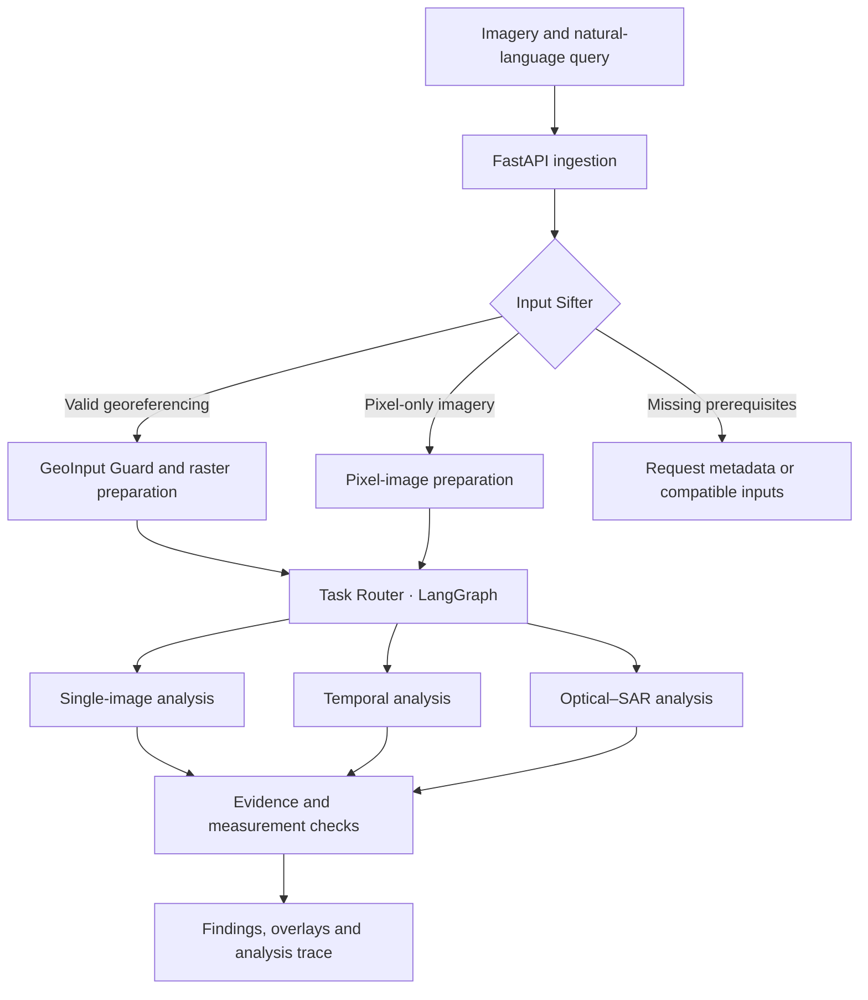

# EarthQuery AI

### Ask a question. Analyse satellite imagery. Inspect the evidence.

**An interactive vision-language assistant for multimodal remote-sensing analysis.**

EarthQuery AI is a research prototype that brings natural-language queries, satellite imagery and specialist vision models into one analysis workflow. It is designed to help users describe scenes, locate regions of interest, compare observations over time and combine optical and Synthetic Aperture Radar (SAR) evidence.

Developed by **Team Anvaya** for **Smart India Hackathon 2026**.

| Problem statement | Theme | Category |
| :--- | :--- | :--- |
| **SIH26167** · EarthQuery AI: An Interactive Vision-Language Assistant for Multimodal Remote Sensing Image Analysis through Text Queries | Space Technology | Software |

> **Project status:** Active prototype development. A frontend and FastAPI backend have been built, with initial TIFF upload and analysis trials. Automatic routing, scientific response quality and workflow integration are being refined. Domain-specific fine-tuning and formal benchmark evaluation remain pending; the architecture below describes the target system.

[Overview](#overview) · [Capabilities](#capabilities) · [Architecture](#architecture) · [Models](#models) · [Development](#development) · [Roadmap](#roadmap)

## Overview

Satellite analysis often requires users to understand sensor types, prepare imagery, choose task-specific models and interpret their outputs in GIS software. Questions involving two dates or complementary sensors add alignment and comparison requirements.

EarthQuery aims to coordinate these steps through a single question-driven interface. The intended workflow combines:

- **Input understanding:** inspect the files, metadata and relationships between images.
- **Task selection:** choose a compatible analysis from the query and validated inputs.
- **Specialist inference:** run the relevant vision or vision-language model.
- **Evidence-based reporting:** connect findings to source imagery, spatial outputs and processing records.

The primary application is analyst-assisted work in government and institutional settings, including environmental monitoring, land-use assessment and disaster-related screening.

### Prototype interface

*The prototype interface for uploading imagery, asking questions and inspecting results.*

## Capabilities

These are the project’s intended capabilities. Availability depends on the implemented worker, compatible checkpoint and input requirements.

| Capability | Example query | Required evidence |
| :--- | :--- | :--- |
| Visual question answering | “What land-cover patterns are visible in this scene?” | Image observations linked to the source |
| Scene captioning | “Summarise this satellite image.” | A description bounded by what the imagery supports |
| Visual grounding | “Locate the water bodies.” | A supported box or mask in the source image |
| Semantic segmentation | “Highlight built-up and vegetation regions.” | Class masks from a suitably trained model |
| Temporal analysis | “What changed between these two dates?” | Aligned before-and-after observations and, when available, a change mask |
| Optical–SAR analysis | “Use both observations to assess possible water-covered regions.” | Compatible paired imagery and task-specific evidence from both modalities |

**The user should select the question and imagery. The system should select the compatible workflow.** When essential metadata is missing, the system should request it instead of guessing a sensor, date or model configuration.

## Prototype gallery

### Single-image analysis

*Single-image workflow: input imagery, a natural-language question and the prototype response. Model adaptation and formal evaluation remain pending.*

### Temporal analysis preview

*Temporal workflow preview using before-and-after imagery of the same area. Change-detection integration and evaluation are ongoing.*

## Architecture

The following diagram shows the intended control flow.

### 1. Ingest and inspect

The API associates the query with its input assets. The Input Sifter inspects file contents and available metadata to determine image type, sensor information, bands, acquisition dates and usable georeferencing.

A file extension alone is insufficient to establish the sensor or permitted analysis.

### 2. Prepare valid inputs

The geospatial route checks the coordinate reference system (CRS), transform, footprint, no-data regions and relevant quality information. Pair-based tasks additionally require suitable overlap, registration and input roles.

Large scenes are prepared through raster windows or tiles, retaining the mapping from each tile to its source. Pixel-only inputs retain pixel coordinates and do not acquire invented geographic metadata.

### 3. Route the task

The LangGraph-based Task Router is designed to combine query intent with the validated input contract. A capability registry records each worker’s accepted modalities, required channels, preprocessing, checkpoint and expected output.

The router should reject incompatible combinations before inference. A natural-language request cannot make an unsupported sensor or missing image pair valid.

### 4. Run specialist workers

Independent workers isolate model dependencies and resource requirements. GPU execution is intended to be queued and memory-aware, loading only the models needed for the selected workflow.

### 5. Assemble supported findings

The results stage checks source references, spatial mappings and quantitative calculations before producing the response. The intended result includes the finding, supporting imagery or overlays, model provenance and relevant limitations.

### Analysis trace preview

*Analysis trace preview. The target trace links input metadata, task selection and worker execution; trace integration is under development.*

## Models

The models below have distinct roles in the design. Inclusion here does not imply completed EarthQuery integration, fine-tuning or validated task accuracy.

| Component | Intended role | Important boundary |
| :--- | :--- | :--- |
| [InternVL3](https://internvl.readthedocs.io/en/latest/internvl3.0/quick_start.html) | Visual question answering and captioning; the architecture proposes a small variant such as InternVL3-2B | General pretrained responses require remote-sensing adaptation and evaluation |
| [CROMA](https://github.com/antofuller/CROMA) | Optical, SAR and joint feature representations | Embeddings require a trained downstream head or validated fusion method to produce task-specific predictions |
| [UPerNet](https://huggingface.co/docs/transformers/model_doc/upernet) | Semantic segmentation for supported land-cover classes | Requires a compatible backbone and task-specific trained weights |
| [ChangeFormerV6](https://github.com/wgcban/ChangeFormer) | Spatial change detection on compatible before-and-after imagery | A binary change mask alone does not establish the changed class or direction |
| Paired-image VQA adapter | Answering questions about temporal differences | Planned adaptation and evaluation; accepting two images does not establish reliable change reasoning |
| Optional grounding worker | Localising text-described regions; GeoGround is a candidate in the architecture | Checkpoint compatibility, memory feasibility and grounding accuracy must be established |

CROMA’s released input configuration uses two Sentinel-1 channels and twelve Sentinel-2 channels. Other sensors, missing bands and rendered image previews require explicit compatibility handling; they are not interchangeable inputs.

## Input requirements

| Input | Required checks | Permitted output |
| :--- | :--- | :--- |
| Georeferenced optical or SAR raster | Valid CRS/transform, usable bands or polarizations, no-data handling and model compatibility | Geographic outputs where metadata and spatial processing are valid |
| JPG/PNG or TIFF without trusted georeferencing | Image validity, available source metadata and compatible model input | Pixel-relative descriptions, boxes or masks |
| Before-and-after pair | Known date order, corresponding geography, common comparison grid and usable overlap | Temporal findings within the shared valid region |
| Optical–SAR pair | Known modalities, compatible channels, registration, footprint and acquisition timing appropriate to the task | Joint analysis when both sensor paths are supported |

A TIFF is not necessarily a usable GeoTIFF. Equal image dimensions do not prove that two images cover the same location.

## Scientific reporting

EarthQuery’s reporting design separates **observations**, **measurements** and **interpretations**.

- **Observations** describe visible or model-supported features.
- **Measurements** are computed from supported masks or geometries with documented units and spatial assumptions.
- **Interpretations** explain possible meaning while retaining uncertainty and alternative explanations.

For example, a change mask may support “a changed region was detected.” Claiming “built-up area increased” additionally requires evidence of the built-up class at both dates. Reporting square kilometres requires defensible geographic area calculation over the common valid region.

Model scores should only be presented as reliability estimates after appropriate calibration. Otherwise, the response should use quality flags and qualified language. Internal evidence checks improve consistency but do not replace evaluation against reference labels.

## Technology stack

This table describes the development architecture; individual services may still be undergoing integration.

| Layer | Technology or approach | Purpose |
| :--- | :--- | :--- |
| User interface | Web-based GIS and query interface | Upload imagery, submit questions and inspect results |
| API | FastAPI and Pydantic | Request handling, validation and structured responses |
| Orchestration | LangGraph and a capability registry | Controlled task selection and execution |
| Raster processing | GDAL and Rasterio | Metadata inspection, windowed reads and spatial preparation |
| Model inference | PyTorch and isolated workers | Specialist inference and model-specific dependencies |
| Persistent records | PostgreSQL; PostGIS for spatial records | Jobs, scene metadata, footprints and evidence relationships |
| Queue | Redis-based job dispatch | Background processing |
| Asset storage | Local or S3-compatible object storage | Source imagery, masks, previews and reports |
| Local infrastructure | Native API/workers with Docker Compose services | Separation of application processes and supporting infrastructure |

The intended provenance chain is:

**Finding → evidence asset → execution step → model/checkpoint → original input.**

## Development

### Current baseline

- Frontend and FastAPI backend implemented.
- Initial TIFF-based trials performed through the interface.
- Input-driven workflow selection and response quality under refinement.
- No completed EarthQuery-specific model fine-tuning or published benchmark results claimed.

### Environment

The documented development machine uses Windows 11, approximately 32 GB RAM and an NVIDIA RTX 5060 with 8 GB VRAM. This is a development reference, not a guaranteed minimum specification.

The intended setup separates the API/core environment from model workers and frontend tooling. Supporting services run through Docker Compose; Windows container setup may involve WSL2.

Actual GPU requirements depend on checkpoint size, precision, image resolution, token count and batch size. Quantization and sequential loading are options to evaluate, not guarantees that every model will fit.

### Local startup sequence

The reproducible installation guide is being finalized alongside repository integration. Exact commands, environment variable names and ports must match the checked-in implementation.

1. Install the dependencies declared for the core backend, each enabled worker and the frontend.
2. Configure service addresses, asset storage and checkpoint locations using the project’s configuration.
3. Start the required database, queue and storage services.
4. Start FastAPI and confirm that its dependencies are reachable.
5. Start compatible model workers and verify checkpoint availability.
6. Start the frontend with the correct API address and permitted origin.
7. Run a small single-image request before testing temporal or multimodal pairs.

Model checkpoints and datasets should be obtained separately according to their upstream access and licensing terms.

## Evaluation plan

Validation is planned at both the workflow and model levels.

| Area | Planned checks |
| :--- | :--- |
| Input handling | Missing georeferencing, incompatible bands, invalid dates and non-overlapping pairs |
| Routing | Correct task selection, unsupported-input rejection and observable execution steps |
| VQA and captioning | Task-appropriate held-out evaluation and review for unsupported claims |
| Grounding and segmentation | Box or mask overlap against reference annotations |
| Change detection | Precision, recall, F1 and IoU on labelled temporal pairs |
| Optical–SAR fusion | Comparison against optical-only and SAR-only baselines |
| System performance | End-to-end latency, peak memory, queue behaviour and worker failure handling |

Training and evaluation should use geographically separated splits where possible to reduce spatial leakage. Candidate resources include BigEarthNet.txt for remote-sensing adaptation and task-specific benchmarks such as VRSBench and CDVQA.

**No accuracy, latency or operational-readiness figures are reported until measured on a documented configuration and evaluation set.**

## Roadmap

- [x] Build the initial frontend and FastAPI backend.
- [x] Perform initial TIFF upload and analysis trials.
- [ ] Stabilise frontend–backend connections and job lifecycle handling.
- [ ] Complete automatic input sifting and compatibility-based routing.
- [ ] Verify tile-to-source mapping and paired-image alignment.
- [ ] Adapt and evaluate the VQA/captioning workflow.
- [ ] Train or integrate validated segmentation and grounding components.
- [ ] Evaluate temporal reasoning separately from binary change detection.
- [ ] Train and benchmark the optical–SAR prediction path.
- [ ] Add evidence-linked reports and uncertainty handling.
- [ ] Integrate authorised Bhoonidhi imagery access and suitable Bhuvan reference layers.
- [ ] Publish reproducible setup instructions, model configurations and benchmark results.

## Application areas

Potential applications include screening riverbank erosion, monitoring coastal ecosystems, examining land-use change and prioritising disaster-related field assessment. These are intended use cases, not claims of completed operational deployments.

Outputs are intended to support analysts and prioritise further inspection. They should retain the imagery’s dates, resolution, coverage and uncertainty so users can judge whether a finding is suitable for their task.

## Contributing

Contributions are welcome in geospatial processing, model adaptation, evaluation, interface development and documentation.

For a bug report, include the task, input format and available metadata, selected worker, expected behaviour and relevant logs. Remove credentials and restricted imagery before sharing. Changes to preprocessing, routing or model configuration should document their effect on outputs.

## Team and acknowledgements

**Team Anvaya**  
Madhav Institute of Technology and Science, Gwalior  
Smart India Hackathon 2026 · Team ID: **MITS/SIH26/301**

EarthQuery builds on the work of the InternVL, CROMA, UPerNet, ChangeFormer and wider open-source geospatial communities. Model and dataset authors retain their respective rights and attribution requirements.

## Licensing

Project licensing is to be specified by the maintainers. Model weights, datasets and third-party dependencies remain subject to their own licences and terms. Inclusion in the architecture does not grant redistribution or commercial-use rights.

