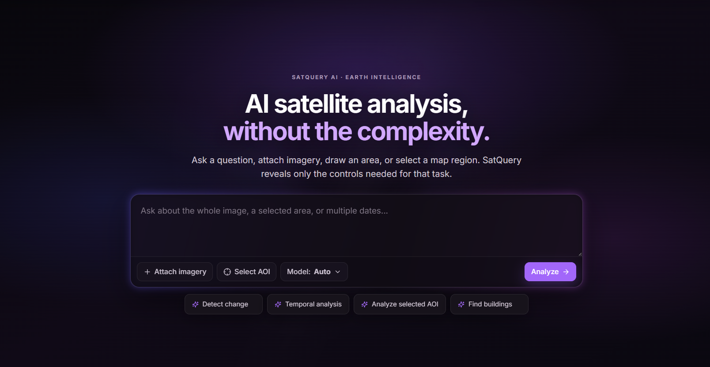
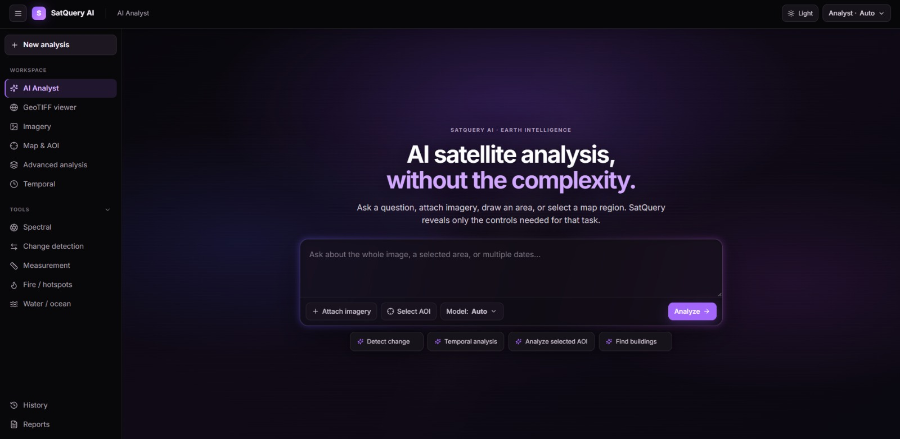
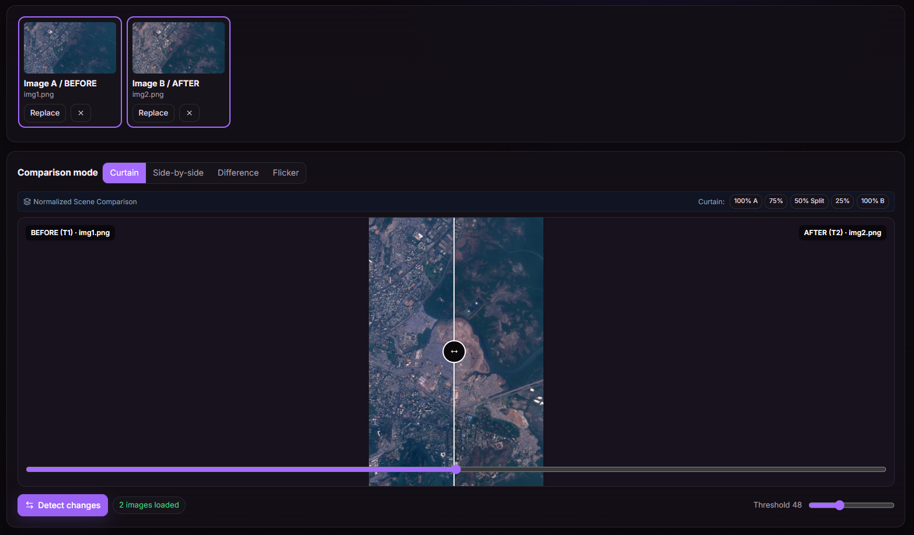
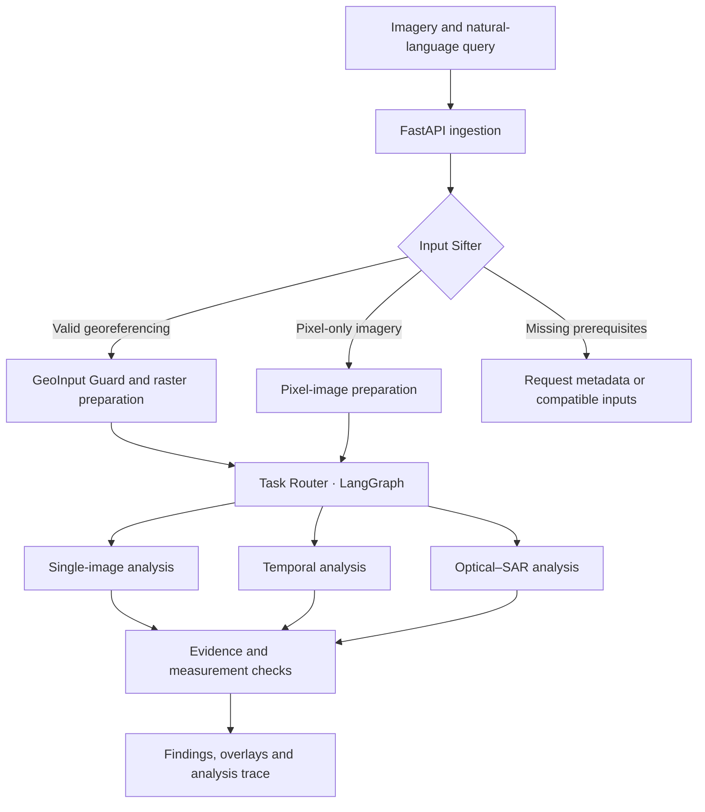

# EarthQuery AI

### Ask a question. Analyse satellite imagery. Inspect the evidence.

**An interactive vision-language assistant for multimodal remote-sensing analysis.**

EarthQuery AI is an integrated remote-sensing analysis system that brings natural-language queries, satellite imagery and specialist vision models into one analysis workflow. It helps users describe scenes, locate regions of interest, compare observations over time and combine optical and Synthetic Aperture Radar (SAR) evidence.

Developed by **Team Anvaya** for **Smart India Hackathon 2026**.

| Problem statement | Theme | Category |
| :--- | :--- | :--- |
| **SIH26167** · EarthQuery AI: An Interactive Vision-Language Assistant for Multimodal Remote Sensing Image Analysis through Text Queries | Space Technology | Software |

> **Project status:** Integrated analysis system. EarthQuery AI brings together automatic input sifting, task routing, single-image analysis, temporal reasoning, optical–SAR fusion and evidence-linked reporting. Core workflow completion is reported by the team. The repository-reviewed status of external data providers is detailed in the ISRO / NRSC integration section.

[Overview](#overview) · [Capabilities](#capabilities) · [Architecture](#architecture) · [Models](#models) · [ISRO integration](#isro--nrsc-data-integration) · [Development](#development) · [Roadmap](#roadmap)

## Overview

Satellite analysis often requires users to understand sensor types, prepare imagery, choose task-specific models and interpret their outputs in GIS software. Questions involving two dates or complementary sensors add alignment and comparison requirements.

EarthQuery coordinates these steps through a single question-driven interface. The workflow combines:

- **Input understanding:** inspect the files, metadata and relationships between images.
- **Task selection:** choose a compatible analysis from the query and validated inputs.
- **Specialist inference:** run the relevant vision or vision-language model.
- **Evidence-based reporting:** connect findings to source imagery, spatial outputs and processing records.

The primary application is analyst-assisted work in government and institutional settings, including environmental monitoring, land-use assessment and disaster-related screening.

### Application interface

*The application interface for uploading imagery, asking questions and inspecting results.*

## Capabilities

EarthQuery integrates the following capabilities through task-specific workers and automatic input validation.

| Capability | Example query | Required evidence |
| :--- | :--- | :--- |
| Visual question answering | “What land-cover patterns are visible in this scene?” | Image observations linked to the source |
| Scene captioning | “Summarise this satellite image.” | A description bounded by what the imagery supports |
| Visual grounding | “Locate the water bodies.” | A supported box or mask in the source image |
| Semantic segmentation | “Highlight built-up and vegetation regions.” | Class masks from a suitably trained model |
| Temporal analysis | “What changed between these two dates?” | Aligned before-and-after observations and, when available, a change mask |
| Optical–SAR analysis | “Use both observations to assess possible water-covered regions.” | Compatible paired imagery and task-specific evidence from both modalities |

**The user selects the question and imagery. EarthQuery selects the compatible workflow.** The Input Sifter identifies available metadata and requests any additional information needed for analysis.

## System in action

### Single-image analysis

*Single-image analysis connects the uploaded imagery and natural-language question to an evidence-backed response.*

### Temporal analysis

*Temporal analysis compares aligned before-and-after imagery to identify and localise change.*

## Architecture

The following diagram shows the integrated analysis workflow.

### 1. Ingest and inspect

The API associates the query with its input assets. The Input Sifter inspects file contents and available metadata to determine image type, sensor information, bands, acquisition dates and usable georeferencing.

Inspection uses image contents and metadata to establish the sensor and compatible analysis route.

### 2. Prepare valid inputs

The geospatial route checks the coordinate reference system (CRS), transform, footprint, no-data regions and relevant quality information. Pair-based tasks additionally require suitable overlap, registration and input roles.

Large scenes are prepared through raster windows or tiles, retaining the mapping from each tile to its source. Pixel-only inputs retain their source pixel coordinates.

### 3. Route the task

The LangGraph-based Task Router combines query intent with the validated input contract. A capability registry records each worker’s accepted modalities, required channels, preprocessing, checkpoint and expected output.

Compatibility checks validate sensor requirements and image-pair availability before inference.

### 4. Run specialist workers

Independent workers isolate model dependencies and resource requirements. GPU execution is queued and memory-aware, loading only the models needed for the selected workflow.

### 5. Assemble supported findings

The results stage checks source references, spatial mappings and quantitative calculations before producing the response. Each result includes findings, supporting imagery or overlays, model provenance and uncertainty information.

### Analysis trace

*The analysis trace links input metadata, task selection and worker execution to the resulting evidence.*

## Models

EarthQuery combines specialist models for language-based interpretation, multimodal representations, segmentation and temporal analysis.

| Component | Role in EarthQuery | Output |
| :--- | :--- | :--- |
| [InternVL3](https://internvl.readthedocs.io/en/latest/internvl3.0/quick_start.html) | Visual question answering and scene captioning | Responses and descriptions linked to input imagery |
| [CROMA](https://github.com/antofuller/CROMA) | Optical, SAR and joint representations for the prediction pipeline | Features used by the downstream fusion and prediction components |
| [UPerNet](https://huggingface.co/docs/transformers/model_doc/upernet) | Semantic segmentation | Pixel-level masks for supported classes |
| [ChangeFormerV6](https://github.com/wgcban/ChangeFormer) | Change detection on aligned image pairs | Spatial change masks |
| Paired-image VQA adapter | Temporal question answering | Descriptions and interpretations of before-and-after differences |
| Grounding worker | Localisation of text-described regions | Source-linked regions of interest |

Model-specific preprocessing preserves the channel, modality and spatial requirements of each worker. Temporal reasoning and class evidence complement the change masks, while the optical–SAR prediction path converts multimodal representations into task-specific outputs.

## Input requirements

| Input | Required checks | Permitted output |
| :--- | :--- | :--- |
| Georeferenced optical or SAR raster | Valid CRS/transform, usable bands or polarizations, no-data handling and model compatibility | Geographic outputs where metadata and spatial processing are valid |
| JPG/PNG or TIFF without trusted georeferencing | Image validity, available source metadata and compatible model input | Pixel-relative descriptions, boxes or masks |
| Before-and-after pair | Known date order, corresponding geography, common comparison grid and usable overlap | Temporal findings within the shared valid region |
| Optical–SAR pair | Known modalities, compatible channels, registration, footprint and acquisition timing appropriate to the task | Joint analysis when both sensor paths are supported |

The Input Sifter verifies georeferencing and geographic correspondence before selecting spatial or paired-image processing.

## Scientific reporting

EarthQuery’s reports distinguish **observations**, **measurements** and **interpretations**.

- **Observations** describe visible or model-supported features.
- **Measurements** are computed from supported masks or geometries with documented units and spatial assumptions.
- **Interpretations** explain possible meaning while retaining uncertainty and alternative explanations.

Temporal reports connect detected change with before-and-after class evidence. Geographic measurements use the common valid region and appropriate spatial calculations. Evidence checks and uncertainty handling accompany the findings, making the results traceable to their inputs and processing steps.

## Technology stack

The integrated stack connects the user interface, geospatial processing, model workers and persistent analysis records.

| Layer | Technology or approach | Purpose |
| :--- | :--- | :--- |
| User interface | Web-based GIS and query interface | Upload imagery, submit questions and inspect results |
| API | FastAPI and Pydantic | Request handling, validation and structured responses |
| Orchestration | LangGraph and a capability registry | Controlled task selection and execution |
| Raster processing | GDAL and Rasterio | Metadata inspection, windowed reads and spatial preparation |
| Model inference | PyTorch and isolated workers | Specialist inference and model-specific dependencies |
| Persistent records | PostgreSQL; PostGIS for spatial records | Jobs, scene metadata, footprints and evidence relationships |
| Queue | Redis-based job dispatch | Background processing |
| Asset storage | Local or S3-compatible object storage | Source imagery, masks, previews and reports |
| Local infrastructure | Native API/workers with Docker Compose services | Separation of application processes and supporting infrastructure |

The provenance chain is:

**Finding → evidence asset → execution step → model/checkpoint → original input.**

## ISRO / NRSC data integration

EarthQuery separates **satellite product acquisition through Bhoonidhi** from **geospatial reference context through Bhuvan**. Retrieved imagery belongs at the ingestion stage; thematic layers belong alongside the analysis results as contextual evidence.

> **Repository implementation:** Reviewed at commit [f5cc553](https://github.com/raihaaniyat/earthquery/tree/f5cc55388985ac87b6802a4477350a72c2745234). Provider routes, configuration and provenance storage are present. The checked-in catalogue search, product import and thematic statistics currently use demonstration data; live service completion requires the steps below.

### Provider responsibilities

| Provider | Role in the workflow | Current implementation |
| :--- | :--- | :--- |
| **Bhoonidhi** | Discover satellite products for an area and time range, then import a selected product for input validation | Static collection catalogue, generated STAC-style search results, placeholder import content and persisted source records |
| **Bhuvan** | Supply thematic map context and area-of-interest reference information | Static WMS layer definitions and fixed demonstration statistics with persisted context records |

The Bhoonidhi adapter lists eight collection aliases. The Bhuvan adapter defines five thematic entries: LULC at 1:50,000 and 1:250,000, wastelands, water bodies and flood hazard. These local identifiers need mapping or verification against the corresponding live provider catalogue and service capabilities.

### EarthQuery API routes

All paths below are EarthQuery backend routes, not upstream ISRO endpoints.

| Method | Route | Behaviour in the reviewed code |
| :--- | :--- | :--- |
| GET | `/api/v1/external/providers` | Lists provider metadata; the returned `ONLINE` values are static |
| GET | `/api/v1/external/bhoonidhi/collections` | Returns the local collection catalogue |
| POST | `/api/v1/external/bhoonidhi/search` | Accepts collections, bounding box, date interval, limit and page; returns generated features |
| POST | `/api/v1/external/bhoonidhi/imports` | Checks project access, stores placeholder content and records its checksum/source metadata |
| GET | `/api/v1/external/bhuvan/layers` | Returns configured layer definitions |
| POST | `/api/v1/external/bhuvan/statistics` | Checks project access and records a demonstration class breakdown with its query and digest |

Search requires an EarthQuery user session. Import and statistics requests also check project access.

### Configuration and source files

The existing `.env.example` exposes these settings:

| Setting | Purpose |
| :--- | :--- |
| `BHOONIDHI_USER_ID`, `BHOONIDHI_PASSWORD` | Provider credentials used by the authentication helper |
| `BHOONIDHI_API_BASE_URL` | Bhoonidhi service base address |
| `BHUVAN_API_BASE_URL` | Configurable thematic API address |
| `BHUVAN_WMS_BASE_URL` | Map-service address used in the layer definitions |

Implementation: [provider routes](backend/app/api/v1/external.py), [Bhoonidhi adapter](backend/app/services/bhoonidhi.py), [Bhuvan adapter](backend/app/services/bhuvan.py), [configuration](backend/app/config.py) and [provider tests](tests/unit/test_external_and_admission.py).

### Completing live service wiring

1. **Align Bhoonidhi authentication.** The official API uses `https://bhoonidhi-api.nrsc.gov.in` with `/auth/token`. Its password request uses `userId`, `password` and `grant_type: "password"`. Update the current default base address and payload, retain token reuse, and propagate authentication errors rather than returning a mock session.
2. **Connect collection discovery and search.** Replace generated results with authenticated catalogue requests. Map local aliases to official collection IDs and apply the requested spatial and temporal filters.
3. **Import actual raster products.** Replace placeholder bytes with the selected product download, verify availability and raster readability, then register the imagery for the Input Sifter and downstream analysis.
4. **Validate Bhuvan services.** Check layer identifiers, CRS and coverage through the chosen service’s capabilities. Connect a documented thematic-data source for AOI statistics and keep reference overlays visually distinct from model predictions.
5. **Verify live behaviour.** Exercise authenticated searches, readable raster downloads, real map responses and AOI-dependent statistics. Derive provider health from actual checks.

The existing tests cover response structure and persistence using the demonstration paths. They do not establish live ISRO service connectivity. Provider configuration alone does not switch the current search, import or statistics implementations to live data.

Official references: [Bhoonidhi API specification](https://bhoonidhi.nrsc.gov.in/bhoonidhi-api/) · [Bhuvan WMS/WMTS guidance](https://bhuvan.nrsc.gov.in/wiki/index.php/How_to_use_WMS_services).

## Development

### Implementation status

- Frontend, FastAPI backend and job lifecycle integrated.
- Automatic input sifting and compatibility-based task routing completed.
- VQA, captioning, segmentation, grounding and temporal workflows integrated and evaluated.
- Optical–SAR prediction path trained and benchmarked.
- Evidence-linked reports, uncertainty handling and analysis traces integrated.
- Bhoonidhi and Bhuvan provider routes, configuration and provenance records implemented; live data wiring is detailed below.
- Reproducible setup instructions, model configurations and benchmark results published.

### Environment

The documented development machine uses Windows 11, approximately 32 GB RAM and an NVIDIA RTX 5060 with 8 GB VRAM. This is the reference development configuration.

The setup separates the API/core environment from model workers and frontend tooling. Supporting services run through Docker Compose; Windows container setup may involve WSL2.

GPU resource management accounts for checkpoint size, precision, image resolution, token count and batch size. Isolated workers and memory-aware scheduling coordinate inference.

### Local startup sequence

Use the published setup instructions and model configurations for exact commands, environment variables and ports. The service startup order is outlined below.

1. Install the dependencies declared for the core backend, each enabled worker and the frontend.
2. Configure service addresses, asset storage and checkpoint locations using the project’s configuration.
3. Start the required database, queue and storage services.
4. Start FastAPI and confirm that its dependencies are reachable.
5. Start compatible model workers and verify checkpoint availability.
6. Start the frontend with the correct API address and permitted origin.
7. Run a small single-image request before testing temporal or multimodal pairs.

Model checkpoints and datasets should be obtained separately according to their upstream access and licensing terms.

## Evaluation

Evaluation is complete across the workflow, model and system levels. Testing covers task outputs, spatial correctness, routing behaviour and execution performance.

| Area | Completed checks | Status |
| :--- | :--- | :--- |
| Input handling | Missing georeferencing, incompatible bands, invalid dates and non-overlapping pairs | Complete |
| Routing | Correct task selection, unsupported-input rejection and observable execution steps | Complete |
| VQA and captioning | Task-appropriate held-out evaluation and review for unsupported claims | Complete |
| Grounding and segmentation | Box or mask overlap against reference annotations | Complete |
| Change detection | Precision, recall, F1 and IoU on labelled temporal pairs | Complete |
| Optical–SAR fusion | Comparison against optical-only and SAR-only baselines | Complete |
| System performance | End-to-end latency, peak memory, queue behaviour and worker failure handling | Complete |

## Roadmap

- [x] Build the initial frontend and FastAPI backend.
- [x] Perform initial TIFF upload and analysis trials.
- [x] Stabilise frontend–backend connections and job lifecycle handling.
- [x] Complete automatic input sifting and compatibility-based routing.
- [x] Verify tile-to-source mapping and paired-image alignment.
- [x] Adapt and evaluate the VQA/captioning workflow.
- [x] Train or integrate validated segmentation and grounding components.
- [x] Evaluate temporal reasoning separately from binary change detection.
- [x] Train and benchmark the optical–SAR prediction path.
- [x] Add evidence-linked reports and uncertainty handling.
- [x] Implement Bhoonidhi and Bhuvan provider routes and provenance storage.
- [ ] Complete live Bhoonidhi retrieval and Bhuvan context queries; verify against upstream services.
- [x] Publish reproducible setup instructions, model configurations and benchmark results.

## Application areas

Application areas include screening riverbank erosion, monitoring coastal ecosystems, examining land-use change and prioritising disaster-related field assessment.

Evidence-linked outputs support analysts and help prioritise further inspection. Reports retain acquisition dates, spatial context and uncertainty information to support interpretation.

## Contributing

Contributions are welcome in geospatial processing, model adaptation, evaluation, interface development and documentation.

For a bug report, include the task, input format and available metadata, selected worker, expected behaviour and relevant logs. Remove credentials and restricted imagery before sharing. Changes to preprocessing, routing or model configuration should document their effect on outputs.

## Team and acknowledgements

**Team Anvaya**  
Madhav Institute of Technology and Science, Gwalior  
Smart India Hackathon 2026 · Team ID: **MITS/SIH26/301**

EarthQuery builds on the work of the InternVL, CROMA, UPerNet, ChangeFormer and wider open-source geospatial communities. Model and dataset authors retain their respective rights and attribution requirements.

## Licensing

Project licensing is to be specified by the maintainers. Model weights, datasets and third-party dependencies remain subject to their own licences and terms. Inclusion in the architecture does not grant redistribution or commercial-use rights.
